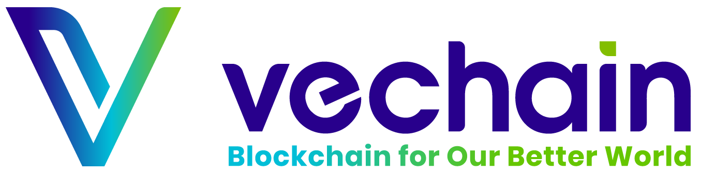

  <a href="https://www.vechain.org/vechainthor/">
    <picture style="padding: 80px;">
        <source srcset="docs/assets/banner-dark-mode.png"  media="(prefers-color-scheme: dark)" >
        
    </picture>
  </a>

---

## Getting Started
VechainThor is the layer 1 blockchain, compatible with Ethereum's ecosystem,which powers the vechain ecosystem. VechainThor is a public blockchain that is designed for mass adoption of blockchain technology by enterprise users of all sizes and is intended to serve as a foundation for a sustainable and scalable enterprise blockchain ecosystem.

___

## Documentation

TODO: Add a little description here

- [Installation](./docs/installation.md) 
- [Running Thor](./docs/running-thor.md)
- [Core Concepts](https://docs.vechain.org/core-concepts)
- [API Reference](https://mainnet.blue.dev.node.vechain.org)

---

## Community

The VechainThor community can be found on [Discourse](https://vechain.discourse.group/) where you can ask questions, voice ideas, and share your projects with other people.

The Vechain Improvement Proposals (VIPs) repository can be found [here](https://github.com/vechain/VIPs).

To chat with other community members you can join:
- [Telegram](https://t.me/VechainDevCommunity)
- [Discord](https://t.me/VeChainDevCommunity)

Do note that our [Code of Conduct](./docs/CODE_OF_CONDUCT.md) applies to all vecahin community channels. Users are **highly encouraged** to read and adhere to them to avoid repercussions.

---

## Contributing

Contributions to VechainThor are welcome and highly appreciated. However, before you jump right into it, we would like you to review our [Contribution Guidelines](./docs/CONTRIBUTING.md) to make sure you have a smooth experience contributing to VechainThor.

---

## Security

If you believe you have found a security vulnerability in Thor, we encourage you to **_responsibly disclose this and NOT open a public issue_**. We will investigate all legitimate reports.

Email `support@vechain.org` to disclose any security vulnerabilities. Alternatively, you can visit this [link](https://support.vechain.org/support/tickets/new) to submit a ticket or find more information.
