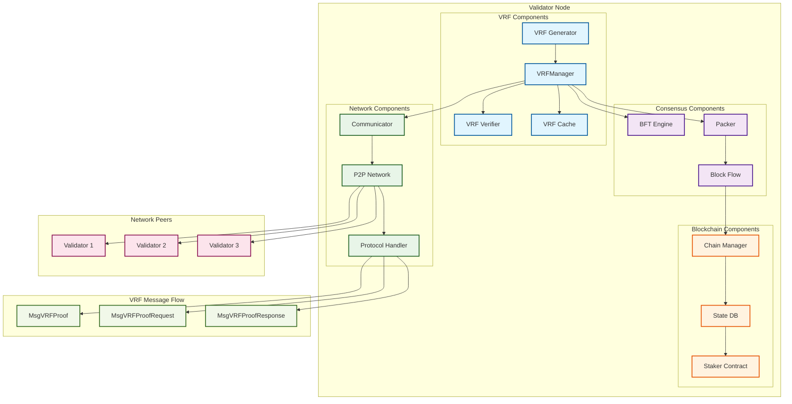
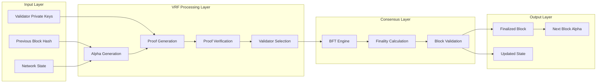

# VRF System Architecture Diagram

## 🎯 Overview

This architecture diagram illustrates the complete VRF system components, their interactions, and how they integrate with the existing VeChainThor blockchain architecture.

## 🏗️ System Architecture



## 🔄 Data Flow Architecture



## 🎯 Component Details

### 1. **VRF Components**

#### VRFManager (`comm/vrf_manager.go`)
- **Purpose**: Central coordinator for all VRF operations
- **Responsibilities**:
  - VRF proof broadcasting
  - Proof collection from peers
  - Local proof caching
  - Cleanup of expired proofs

#### VRF Generator
- **Purpose**: Generate VRF proofs for validators
- **Input**: Alpha (seed) + Private Key
- **Output**: Cryptographically verifiable proof

#### VRF Verifier
- **Purpose**: Verify VRF proofs from other validators
- **Input**: Proof + Public Key + Alpha
- **Output**: Verification result

#### VRF Cache
- **Purpose**: Store proofs for efficient access
- **Features**: Automatic cleanup, thread-safe access

### 2. **Consensus Integration**

#### BFT Engine
- **VRF Integration**: Uses VRF for validator selection
- **Finality Impact**: VRF affects consensus finality
- **Fallback**: Traditional consensus if VRF fails

#### Packer
- **Block Creation**: Integrates VRF proof collection
- **Header Assembly**: Embeds VRF proofs in block header
- **Flow Management**: Coordinates VRF with block proposal

### 3. **Network Communication**

#### Communicator
- **P2P Integration**: Manages VRF message propagation
- **Protocol Handling**: Processes VRF message types
- **Peer Management**: Coordinates with network peers

#### Protocol Handler
- **Message Types**: Handles VRF proof and request messages
- **Serialization**: RLP encoding/decoding of VRF data
- **Validation**: Message format and content validation

### 4. **Blockchain Integration**

#### Chain Manager
- **Block Processing**: Handles blocks with VRF proofs
- **State Updates**: Updates blockchain state with VRF data
- **Fork Management**: Handles VRF-related forks

#### Staker Contract
- **Public Key Storage**: Stores validator public keys
- **VRF Registration**: Validates VRF public key registration
- **Validator Management**: Manages validator eligibility

## 🔧 Integration Points

### 1. **VRF → BFT Integration**
```go
// VRF selection in BFT consensus
selectedValidators := vrf.WeightedValidatorSelectionWithProofs(
    validators, alpha, maxProposers, proofs, publicKeys
)

// BFT uses VRF selection for finality
bftEngine.SetValidatorSet(selectedValidators)
```

### 2. **VRF → Packer Integration**
```go
// Packer collects VRF proofs during block creation
proofs := vrfManager.CollectVRFProofs(ctx, alpha, blockNumber, validators)

// Packer embeds proofs in block header
builder.ValidatorVRFProofs(proofs)
```

### 3. **VRF → Network Integration**
```go
// VRFManager broadcasts proofs via P2P
communicator.VRFManager().BroadcastVRFProof(validator, alpha, proof, blockNumber)

// Network handles VRF message routing
protocol.HandleVRFProof(proof)
```

## 📊 Performance Characteristics

### Resource Usage
- **CPU**: ~1-2% additional for VRF operations
- **Memory**: ~10-50MB for proof caching
- **Network**: ~1-5KB per VRF message
- **Storage**: Minimal (proofs in block headers)

### Scalability
- **Validators**: Supports 100+ validators
- **Proof Collection**: O(n) complexity
- **Verification**: O(n) complexity
- **Network**: Efficient P2P propagation

## 🛡️ Security Considerations

### Cryptographic Security
- **VRF Algorithm**: secp256k1-based VRF
- **Proof Verification**: Cryptographic validation
- **Key Management**: Secure private key handling

### Network Security
- **Message Validation**: All VRF messages validated
- **Replay Protection**: Block number and timestamp checks
- **DoS Protection**: Rate limiting and timeouts

### Consensus Security
- **Finality Impact**: VRF directly affects consensus
- **Fallback Mechanisms**: Traditional consensus backup
- **Fork Resolution**: VRF-aware fork handling

---

*This architecture diagram shows how VRF integrates seamlessly with existing VeChainThor components while providing cryptographically verifiable randomness for consensus finality.* 