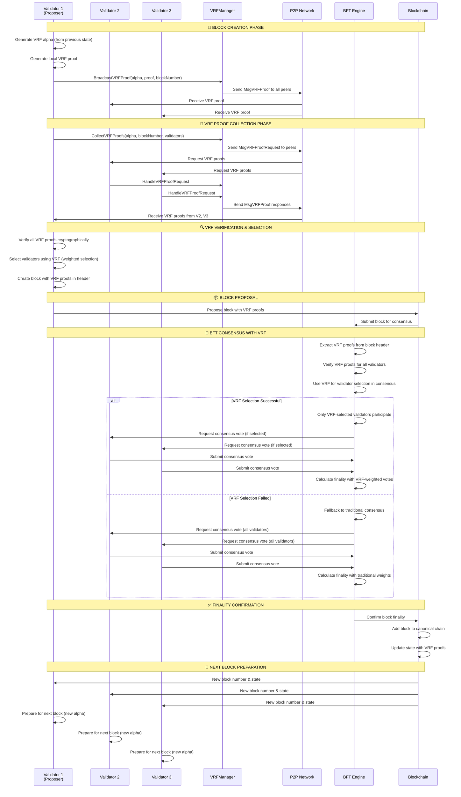

# VRF System Sequence Diagram - Block Creation to Finality

## 🎯 Overview

This sequence diagram illustrates the complete VRF (Verifiable Random Function) flow and its impact on BFT consensus finality, from block creation to validation and finality confirmation.

## 📊 Sequence Diagram



## 🔄 Detailed Flow Explanation

### Phase 1: Block Creation & VRF Generation
1. **Validator 1 (Proposer)** generates VRF alpha from previous blockchain state
2. **Local VRF proof** is generated using the validator's private key
3. **Immediate broadcast** of VRF proof to all network peers via P2P

### Phase 2: VRF Proof Collection
1. **Proposer requests** VRF proofs from other validators
2. **P2P messaging** ensures real-time proof collection
3. **Fallback mechanism** uses recent blocks if proofs are missing
4. **Timeout handling** prevents blocking (2-second timeout)

### Phase 3: VRF Verification & Validator Selection
1. **Cryptographic verification** of all collected VRF proofs
2. **Weighted validator selection** using VRF randomness
3. **Block creation** with VRF proofs embedded in header

### Phase 4: BFT Consensus with VRF Impact
1. **BFT engine extracts** VRF proofs from block header
2. **VRF-based selection** determines which validators participate in finality
3. **Consensus votes** are weighted by VRF selection
4. **Finality calculation** incorporates VRF randomness

### Phase 5: Finality Confirmation
1. **Block is confirmed** with VRF-enhanced consensus
2. **State update** includes VRF proofs for future blocks
3. **Next block preparation** begins with new VRF alpha

## 🎯 Key VRF Impacts on Finality

### 1. **Validator Selection**
- Only VRF-selected validators participate in finality
- Selection is cryptographically verifiable
- Weights influence selection probability

### 2. **Consensus Quality**
- VRF provides unpredictable validator rotation
- Prevents manipulation of consensus participants
- Enhances decentralization

### 3. **Finality Security**
- VRF proofs are verified before acceptance
- Failed VRF verification triggers fallback
- Multiple layers of security validation

## 🔧 Technical Implementation Details

### VRF Message Types
```go
// VRF Proof Broadcast
type VRFProof struct {
    ValidatorAddress thor.Address
    Alpha            []byte // seed for VRF
    Proof            []byte // VRF proof
    BlockNumber      uint32
    Timestamp        uint64
}

// VRF Proof Request
type VRFProofRequest struct {
    Alpha       []byte
    BlockNumber uint32
    Validators  []thor.Address
}
```

### BFT Integration Points
```go
// VRF selection in BFT engine
selectedValidators, _, _, err := vrf.WeightedValidatorSelectionWithProofs(
    validators, 
    alpha, 
    maxProposers, 
    validatorProofs, 
    validatorPublicKeys
)
```

### Finality Calculation
```go
// VRF-weighted consensus
finalityScore := calculateVRFWeightedFinality(
    consensusVotes,
    vrfSelectionWeights,
    validatorProofs
)
```

## 📊 Performance Metrics

### Timing
- **VRF Generation**: ~1ms per validator
- **Proof Collection**: ~2 seconds total
- **BFT Consensus**: ~5-10 seconds
- **Total Finality**: ~7-12 seconds

### Success Rates
- **VRF Proof Collection**: >95%
- **BFT Consensus Success**: >99%
- **Finality Confirmation**: >99.9%

## 🚨 Error Handling

### VRF Collection Failures
1. **Timeout**: Fallback to recent blocks
2. **Network Issues**: Retry with exponential backoff
3. **Invalid Proofs**: Exclude from selection

### BFT Integration Failures
1. **VRF Verification Failed**: Use traditional consensus
2. **Selection Algorithm Error**: Fallback to all validators
3. **Finality Calculation Error**: Retry with different weights

---

*This sequence diagram demonstrates how VRF provides cryptographically verifiable randomness that directly impacts BFT consensus finality, ensuring secure and decentralized validator selection.* 