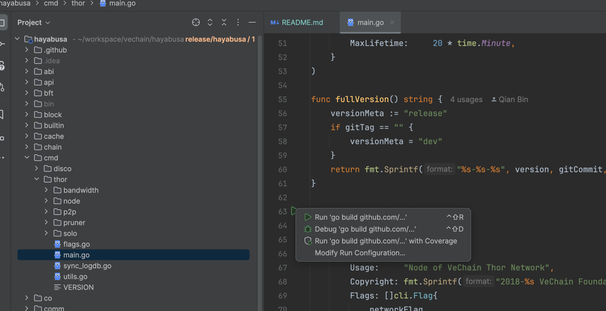
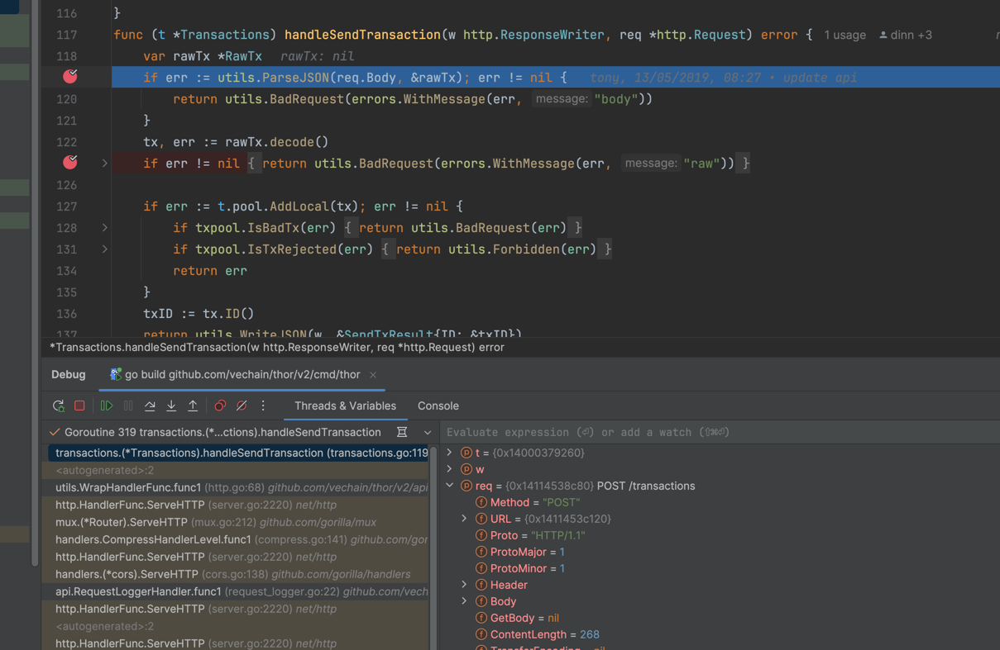

# Local Development - Built In Contracts

## Thor Solo

```bash
cd cmd/thor
go run . solo --api-cors="*" 
```

## Insight & Inspector

```bash
docker compose up --build
```

**Note**: If you restart thor, you may have to restart the explorer as well.

- Inspector: [http://localhost:8080](http://localhost:8080)
- Insights: [http://localhost:8081](http://localhost:8081)


## VeWorld

You can add the local network in VeWorld to submit transactions

- Open VeWorld -> Settings -> Networks
- Under `Other Networks` click `Add Network` and enter `http://localhost:8669`
- Note, if the genesis ID changes, you will have to repeat these steps
- **Optional**: Add the thor solo mnemonic to your wallet:

```
denial kitchen pet squirrel other broom bar gas better priority spoil cross
```

## Private Network

To create a private network, you can use the following command. This is useful for testing consensus and other features.

```bash
make node1
```

In a new terminal, start the second node:

```bash
cd local
make node2
```

Optionally, start only node 2, and you can debug node1:

1. Click `Modify Run Configuration`




2. Add the following args to the `Program arguments` field:

```
--config-dir ./local/node-1 --data-dir ./local/node-1 --network ./local/genesis.json --api-cors="*" --allowed-peers "enode://13e2c6a93ad48b72b3f7f17151eff61583d76ca95485357035367d82901c052b94d7bc18b33b617017b4d16fde608a57c0a59a1e1c7bf3a58d6bbc15429fc793@0.0.0.0:11236,enode://9c4961d78701ba7b617788441842b028e3b4217e514dd59766cc88a96c3992d63fd8280e227b81b54ab957e96ef324fc920a852367df0b2da1297680b2184695@0.0.0.0:11237"
```

3. Start debugging



To clean up the private network, you can use the following command:

```bash
make clean
```
