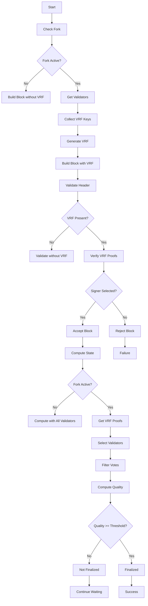
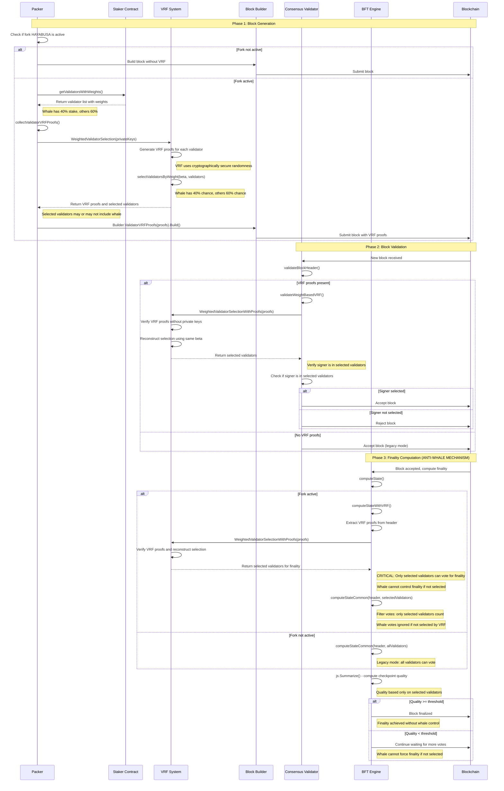

# VRF Finality Flow

## Sequence Diagram

## Anti-Whale Mechanism Explanation

### **Key Point: VRF Selection for Finality**
The critical anti-whale mechanism happens in **Phase 3** during finality computation:

1. **VRF Selection**: `vrf.WeightedValidatorSelectionWithProofs()` selects validators using cryptographically secure randomness
2. **Vote Filtering**: `computeStateCommon(header, selectedValidators)` only counts votes from VRF-selected validators
3. **Whale Prevention**: If a whale (40% stake) is not selected by VRF, their votes are completely ignored for finality

### **Example Scenario:**
- **Whale**: 40% stake, 40% chance of being selected
- **Other Validators**: 60% stake, 60% chance of being selected
- **If Whale Not Selected**: Whale cannot vote for finality, cannot block the process
- **If Whale Selected**: Whale can vote, but only with their proportional weight among selected validators

### **Security Guarantees:**
1. **No Whale Control**: Whale cannot guarantee they will be selected for finality
2. **Proportional Influence**: When selected, influence is proportional to stake among selected validators
3. **Verifiable Randomness**: Selection is cryptographically verifiable and unpredictable
4. **Decentralized Finality**: Finality depends on randomly selected validator subset

## Flow Explanation

### **Phase 1: Packer (Block Generation)**
1. **Check Fork**: `header.Number() >= forkConfig.HAYABUSA`
2. **Get Validators**: `getValidatorsWithWeights()` from `builtin.Staker.LeaderGroup()`
3. **Collect Keys**: `collectValidatorVRFProofs()` gets available private keys
4. **Generate VRF**: `vrf.WeightedValidatorSelection()` with private keys
5. **Build Block**: `Builder.ValidatorVRFProofs().Build()` includes VRF proofs

### **Phase 2: Consensus (Block Validation)**
1. **Validate Header**: `validateBlockHeader()` checks block structure
2. **Check VRF**: `header.ValidatorVRFProofs()` extracts VRF proofs
3. **Verify VRF**: `vrf.WeightedValidatorSelectionWithProofs()` validates proofs
4. **Check Signer**: `slices.Contains(selectedValidators, signer)` confirms selection

### **Phase 3: BFT Engine (Finality)**
1. **Compute State**: `computeState()` calculates BFT state
2. **VRF Filtering**: `computeStateWithVRF()` uses only VRF-selected validators
3. **Filter Votes**: `computeStateCommon(header, selectedSet)` filters validator votes
4. **Compute Quality**: `js.Summarize()` calculates checkpoint quality
5. **Finalization**: Quality threshold determines finality

### **VRF Components**
- **`vrf.Prove()`**: Generates beta (random hash) and pi (VRF proof)
- **`selectValidatorsByWeight()`**: Uses beta as seed for weighted selection
- **`vrf.WeightedValidatorSelectionWithProofs()`**: Validates VRF proofs without private keys

### **Security Benefits**
1. **Anti-Whale**: Whale cannot control finality if not selected
2. **Verifiable Randomness**: VRF provides cryptographically secure randomness
3. **Decentralization**: Voting power distributed proportionally to stake
4. **Backward Compatibility**: System works without VRF before fork 